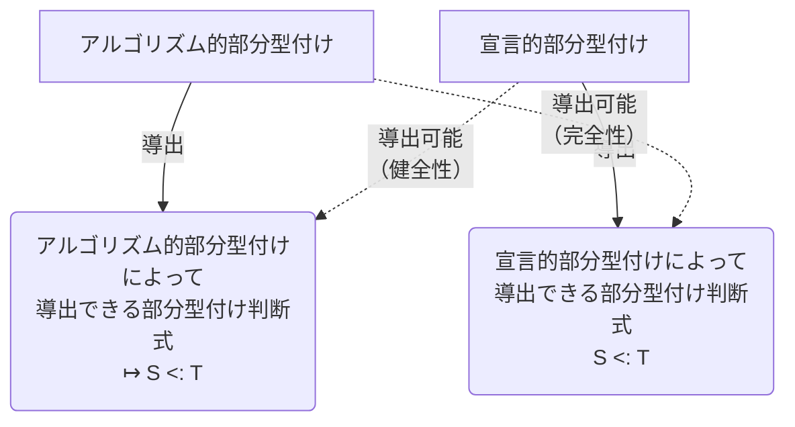
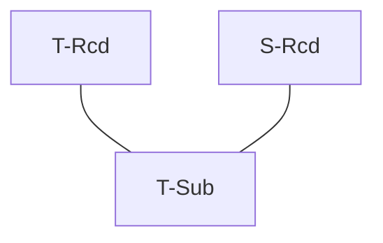
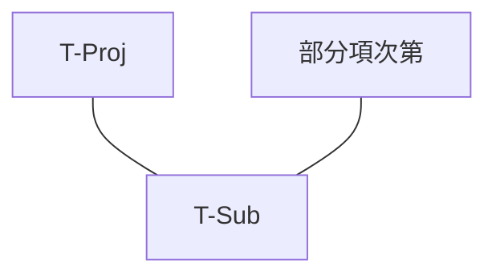
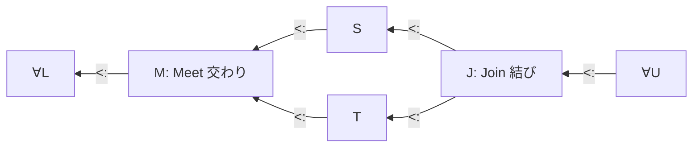

# 第 16 章 部分型付けのメタ理論

> テキストの解答要約はこんな感じで引用表現にする（引用じゃないけど）

- 気持ち
  - 15章の**宣言的な**部分型関係や型付け規則は、諸々の定理の証明には便利だけど、型検査アルゴリズムが組みにくい
    - どこでも当てはまってしまうような規則が含まれているため
  - 構文主導（？）の**アルゴリズム的**部分型付け・型付け規則を作り、15章のものと実質同じであることを示せば、型安全性などが証明済みで、検査が容易な型検査アルゴリズムを構成できるってわけ
    - アルゴリズム的に部分型関係であることを $\mathsf{\mapsto S <: T}$ と書く。

## 演習 16.1.2. [推奨, $\star\star\star$]

- 補題 16.1.2. 
  - (1) すべての型 $\mathsf{S}$ について、 $\mathsf{S <: S}$ は S-Refl を使わずに導出できる。
    -  $\mathsf{S = Top}$ のとき、 S-Top より成り立つ
    -  $\mathsf{S = S_1 \rarr S_2}$ の形で表されるとき、 S-Arrow において、 $\mathsf{T_1 = S_1}, \mathsf{T_2 = S_2}$ とすることで導出できる。
      - 前提部は $\mathsf{U <: U}$ の形だが、仮定より、 S-Refl を使わずに導出できる。
    -  $\mathsf{S} = \{\mathsf{k}_j:{\mathsf{S}_j}^{j \in 1..m}\}$ の形で表されるとき、 S-Rcd において、 $\forall j \in 1..m . \mathsf{l}_l = \mathsf{k}_j, \mathsf{S}_j = \mathsf{T}_j, n=m$ とすることで導出できる。
      - 前提部は $\mathsf{U <: U}$ の形を S-Refl を使わずに導出できること以外は自明に成立する。
  - (2) もし $\mathsf{S <: T}$ が導出可能ならば、 $\mathsf{S <: T}$ は S-Trans を使わずに導出できる。
    -  $\mathsf{S = Top}$ のとき、  $\mathsf{S <: T}$ が導出可能ならば、 $\mathsf{T = Top}$ しか取り合えないので、 S-Top より成り立つ。
    -  $\mathsf{T = Top}$ のとき、前提なしに S-Top より成り立つ
    -  $\mathsf{S = S_1 \rarr S_2}$ の形で表されるとき、 $\mathsf{S <: T}$ が導出可能ならば、 $\mathsf{T = T_1 \rarr T_2}$ の形を取り、 S-Arrowにより導出される。
    -  $\mathsf{S} = \{\mathsf{k}_j:{\mathsf{S}_j}^{j \in 1..m}\}$ の形で表されるとき、 $\mathsf{S <: T}$ が導出可能ならば、 $\mathsf{T} = \{\mathsf{l}_i:{\mathsf{T}_i}^{i \in 1..n}\}$ の形を取り、 S-Rcd により導出される。

## 演習 16.1.3. [$\star$]

- 型 $\mathsf{Bool}$ を追加したらどのように性質が変化するか。
  - 補題の証明において、
    - (1) $\mathsf{S = Bool}$ のとき、 S-Trans において、  $\mathsf{U = Bool}, \mathsf{T = Bool}$ とすることで導出できる。
    - (2) $\mathsf{S = Bool}$ のとき、 型 $\mathsf{T}$ は $\mathsf{Bool}$ か $\mathsf{Top}$ のどちらかであり、前者なら S-Refl, 後者なら S-Top を使うことで導出できる
- オリジナルの補題の証明との違いは、(1) の証明に S-Trans が必要で、(2) の証明に S-Refl が必要となる点にある
  - 2つの証明が互いを証明済みの前提として相互に参照しあっているので、なんとも微妙である

### メモ：健全性と完全性

## 演習 16.2.1. [$\star\nrightarrow$]

- T-Rcd
  - T-Rcd の前に T-Sub が使われているということは、レコードの1つ以上の要素に対して T-Sub が使われていることになる。 このとき、T-Sub に登場する部分型を用いて、レコード全体の部分型となるレコードの型を作ることができ、導出の最後の T-Sub に用いる。
  - 導出の最後のT-Subの右側のインスタンスを導出するには、レコードの部分型関係を導出できる S-Rcd を用いる

- T-Proj
  - T-Proj の前に T-Sub が使われているということは、射影した要素に対して T-Sub が使われていることになる。 このとき生じている部分型関係を導出の最後、射影を行っている項の型に用いれば良い
  - 導出の最後のT-Subの右側のインスタンスでは、レコードの要素の型について部分型関係の導出を行うが、ここでは要素の型は制限されていないので、S-Top, S-Arrow, S-Rcdのどれが使われるかは部分項の型による

### メモ：構文主導的

- 気持ち
  - T-Sub は導出の前後で注目する項そのものは変わらない。
  - 構文主導的というのは、おそらく項の形によって適用すべき型付け規則が絞り込まれるというのを意味してるのだと思う

## 演習 16.2.3. [$\star\nrightarrow$]

$\sf (\lambda x : Bool . x) \  True : Top$

これを評価すると E-App より

$\sf True : Bool$

が得られる。

このとき、 $\sf Bool <: Top$ かつ $\sf Top \not <: Bool$ が成り立つ。

## 定理 16.2.5. [完全性、最小型付け] [証明] 演習 [推薦, $\star\star$] 

宣言的型付け導出に関する帰納法

pass

## 演習 16.2.6. [$\star\star$] 

部分型付け規則 S-Arrow をなくしても最小型付けの性質を持つか？

pass

### メモ：結びと交わり

## 命題 16.3.2. [結びと有界な交わりの存在] [証明] 演習 [推薦, $\star\star\star$] 

pass

## 演習 16.3.3. [$\star\star$] 

pass

## 演習 16.3.4. [$\star\star\star$] 

pass

## 演習 16.4.1. [$\star$] 

T2, T3 が Bot のときは TA-If で対応可能だが、 T1 が Bot のとき式全体が Bot になるためには別途新たなアルゴリズム的型付け規則が必要である。