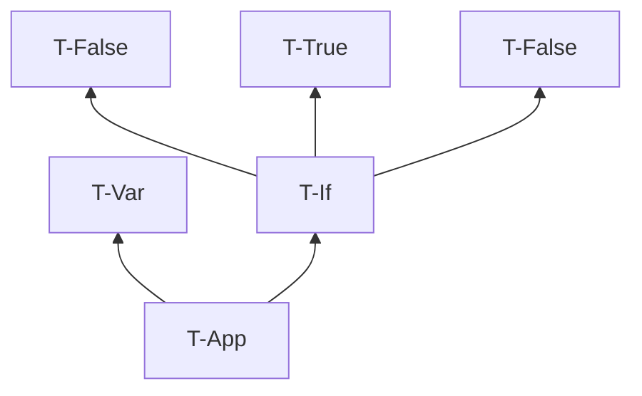
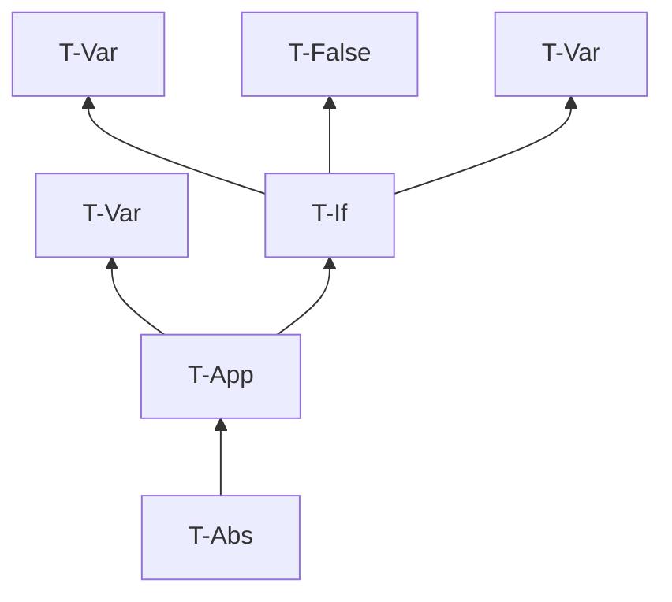

# 第 9 章 単純型付きラムダ計算

> 注意： 引用表現の部分では引用ではなく、回答の要約や解釈を書いている。

## 9.1 関数型

定義 9.1.1.

-  Bool 上の単純型の集合

## 9.2 型付け関係

- 明示的型付けを扱う
- 暗黙的型付けは第 22 章で

### 演習 9.2.1. $[\star]$

- 縮退ってなんだっけ
- ここでは、well typed な項が1つもないことを説明する

あらゆる項は評価を繰り返すことにより、行き詰まり状態になるか、値になる。
純粋型付きラムダ計算では、項が値に評価されるとき、その値はラムダ抽象値である。
ラムダ抽象値の束縛変数xはメタ変数の型Tを持つが、これは具体的な型ではない。
well typed であるためには具体的な型を与えればよいが、どの型付け規則も具体手な型を与えない。
よって、あらゆる項は well typed ではない。

### 演習 9.2.2. $[\star \nrightarrow]$

全部書くと大変なので型付け規則だけ。

#### (1)

#### (2)

### 演習 9.2.3. $[\star]$

サンプル: $\Gamma = {\sf f : Bool \rightarrow Bool \rightarrow Bool, x : Bool, y : Bool}$

集合を表す記述: $\Gamma = {\sf \forall T_1 T_2. f : T_1 \rightarrow T_2 \rightarrow Bool, x : T_1, y : T_2}$

## 9.3 型付けの性質

補題 9.3.1 [型付け関係の逆転]

- 逆転補題とも

### 演習 9.3.2. $[推奨, \star\star\star]$

存在しない。

[証明] $\Gamma \vdash {\sf x\ x : T}$ なる文脈 $\Gamma$ と型 ${\sf T}$ が存在すると仮定する。
逆転補題(3)より、 $\Gamma \vdash {\sf x\ x : T}$ ならば、  $\Gamma \vdash {\sf x : T_{11} \rightarrow T}$ と $\Gamma \vdash {\sf x : T_{11}}$ を満たす ${\sf T_{11}}$ が存在する。
このとき、文脈 $\Gamma$ の下で ${\sf x}$ が ${\sf T_{11} \rightarrow T}$ かつ ${\sf T_{11}}$ という型を持つことになり、矛盾する。
ゆえにそのような文脈 $\Gamma$ と型 ${\sf T}$ は存在しない。

> 矛盾を指摘するためには、型が有限のサイズを持つことを示す必要がある。
> 型が無限のサイズを持つことが許されるとき、${\sf T_{11} \rightarrow T} = {\sf T_{11}}$ という等式の解を構築できうる（20章）。

### 定理 9.3.3. $[推奨, \star\star\star]$

方針: 項がある形を持つとき、項は型を持つ→型を持つならそれは関数の型またはBool型のどちらか一方を持つ、という流れにする。

[証明] 項に関する構造帰納法で示す。ある型付け文脈 $\Gamma$ と項 ${\sf t}$ について、項 ${\sf t}$ が

- 変数 x と表されるとき、 仮定より、 $\Gamma$ の定義域に含まれる自由変数であるため、
  ある型 ${\sf T}$ が存在して、 $\Gamma \vdash {\sf x:T}$ となる。
  このとき型付け規則は T-App しか適用できないため、型 ${\sf T}$ は関数の型にならず、とりうる型はBoolのみである。ゆえに唯一の型を持つ。
- ラムダ抽象 $\lambda {\sf x:T.t_1}$ の形で表され、
  - 部分項 ${\sf t_1}$ が唯一の型 ${\sf T_1}$ を持つとする。
    このとき型付け規則は T-Abs のみが適用でき、 $\Gamma \vdash \lambda {\sf x:T.t_1 : T \rarr T_1}$ となり、これは関数の型である。
  - 部分項 ${\sf t_1}$ が型を持たない場合は、どの型付け規則も適用できないため項 ${\sf t}$ も型を持たない。
- 関数適用 ${\sf t_1 \ t_2}$ の形で表され、
  - 部分項 ${\sf t_1}$ が ${\sf T_{11} \rarr T_{12}}$ の形をした唯一の型を持ち、かつ、部分項 ${\sf t_2}$ が唯一の型 ${\sf T_{12}}$ を持つとする。
    このとき型付け規則は T-App のみが適用でき、 $\Gamma \vdash {\sf t_1 \ t_2 : T_{12}}$ となり、帰納法の仮定より部分項 ${\sf t_2}$ の唯一の型 ${\sf T_{12}}$ は関数の型またはBool型のどちらか一方を持つので、項 ${\sf t}$ も所望の性質が成り立つ。
  - それ以外の場合は、どの型付け規則も適用できないため項 ${\sf t}$ は型を持たない。

> - 項が2つの型を持つことを仮定し、型の導出に関する帰納法により、2つの型が等しくなることを示す。
>   - 唯一性の証明をするときの常套手段っぽい
>     - $\forall x. P(x,s)かつP(x,t)$ を仮定 → $s=t$ を示す
> - ここでは、片方の型を型付け規則による導出、もう片方を逆転補題に使い、部分項が仮定より等しくなることを使って2つの型が等しいことを示す
> - 各型付け規則で場合分け
>   - T-Trueとかを忘れないように（忘れてた）

補題 9.3.4. [標準形]

- 型が決まれば、項を限定できる
  - 進行定理の証明に使える

定理 9.3.5. [進行]

- 気づき: 「t → t' なる t' が存在する」という言明は「1ステップ評価が可能」とも言える

以下、保存定理に向けての補題が続く

補題 9.3.6. [並べ替え]

型付け文脈は並び替えても型付け判断は変わらん

補題 9.3.7. [弱化]

型付け文脈の定義域にない変数は、型付け文脈に追加しても型付け判断は変わらん

補題 9.3.8. [代入の下での型の保存]

- 代入補題とも
  - 評価が正しい型付けを保存することが証明できる
- p.54 の代入の定義を使うことになる

### 定理 9.3.9. [型保存] $[推奨, \star\star\star]$

[証明] $\Gamma \vdash {\sf t : T}$ の導出に関する帰納法による。帰納法の各ステップにおいて、すべての部分導出に関して所望の性質が成り立つと仮定する。

そして、導出の最後の規則についての場合分けにより証明を進める。

- T-Var の場合 ${\sf t = x \quad T = T_1 \quad x : T_1} \in \Gamma$

  導出の最後の規則が T-Var ならば、その規則の形から、 $\sf t$ は $\sf x$ という変数の形で、 ${\sf x : T_1} \in \Gamma$ を結論とする部分導出があることがわかる。
  しかし $\sf t$ は変数なので、どんな $\sf t'$ に対しても $\sf t \rarr t'$ とならず、定理の要求は自明に満たされる。

- T-Abs の場合 ${\sf t = \lambda x : T_1. t_2 \quad T = T_1 \rarr T_2} \quad \Gamma, {\sf x : T_1 \vdash t_2 : T_2}$

  導出の最後の規則が T-Abs ならば、その規則の形から、 ${\sf t},\ {\sf T}$ は上記を満たし、 $\Gamma, {\sf x : T_1 \vdash t_2 : T_2}$ なる部分導出がある。
  しかし $\sf t$ はラムダ抽象値なので、どんな $\sf t'$ に対しても $\sf t \rarr t'$ とならず、定理の要求は自明に満たされる。

- T-App の場合 ${\sf t = t_1\ t_2} \quad {\sf T = T_{12}} \quad \Gamma \vdash {\sf t_1 : T_{11} \rarr T_{12}} \quad \Gamma \vdash {\sf t_2 : T_{11}}$ 

  導出の最後の規則が T-App ならば、その規則の形から、 ${\sf t},\ {\sf T}$ は上記を満たし、 $\Gamma \vdash {\sf t_1 : T_{11} \rarr T_{12}}$ と $\Gamma \vdash {\sf t_2 : T_{11}}$ をそれぞれ結論とする部分導出がある。
  ここで、左側に関数適用が現れる評価規則を見ると、 $\sf t \rarr t'$ を導出できる規則は3つ、E-App1, E-App2, E-AppAbs があるとわかる。
  それぞれの場合について別々に考える。

  - E-App1 の場合 ${\sf t_1 \rarr t_1'} \quad {\sf t' = t_1'\ t_2}$ 

    場合分け T-App の仮定から、結論が $\Gamma \vdash {\sf t_1 : T_{11} \rarr T_{12}}$ である、元の型付け導出の部分導出が得られる。
    帰納法の仮定をこの部分導出に適用して $\Gamma \vdash {\sf t_1' : T_{11} \rarr T_{12}}$ を得る。
    この事実と $\Gamma \vdash {\sf t_2 : T_{11}}$ を合わせると規則 T-App が適用でき、 $\Gamma \vdash {\sf t = t_1'\ t_2 : T_{12}}$ となる。
    つまり ${\sf t' : T}$ が成り立つ。

  - E-App2 の場合: E-App1 の場合と同様

  - E-AppAbs の場合  ${\sf t_1 = (\sf \lambda x : T_{11}. t_{12})} \quad {\sf t_2 = v_2} \quad {\sf t' = [x \mapsto v_2]t_{12}}$

    ${\sf t \rarr t'}$ が E-AppAbsを使って導出されたならば、この規則の形から、 ${\sf t_1,\ t_2,\ t'}$ は上記を満たすことがわかる。
    このとき、場合分け T-App の仮定から、結論が $\Gamma \vdash {\sf t_1 : T_{11} \rarr T_{12}}$ 部分導出があり、型付け関係の逆転（2）を適用して、 $\Gamma, {\sf x : T_{11}} \vdash {\sf t_{12} : T_{12}}$ となる。
    さらに、場合分け T-App の仮定から、結論が $\Gamma \vdash {\sf t_2 : T_{11}}$ となる部分導出があり、先程の $\Gamma, {\sf x : T_{11}} \vdash {\sf t_{12} : T_{12}}$ と合わせて代入補題を適用でき、 $\Gamma \vdash {\sf [x \mapsto v_2]t_{12} : T_{12}}$ となる。
    つまり ${\sf t' : T}$ が成り立つ。

- 他の規則の場合は、定理 8.3.3. の型付き算術式における保存定理と同様

### 演習 9.3.10. $[推奨, \star\star]$