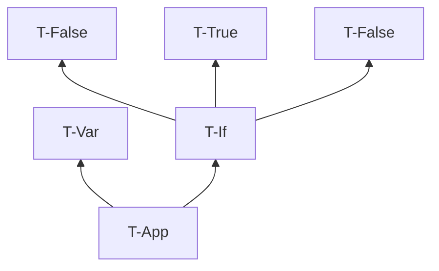
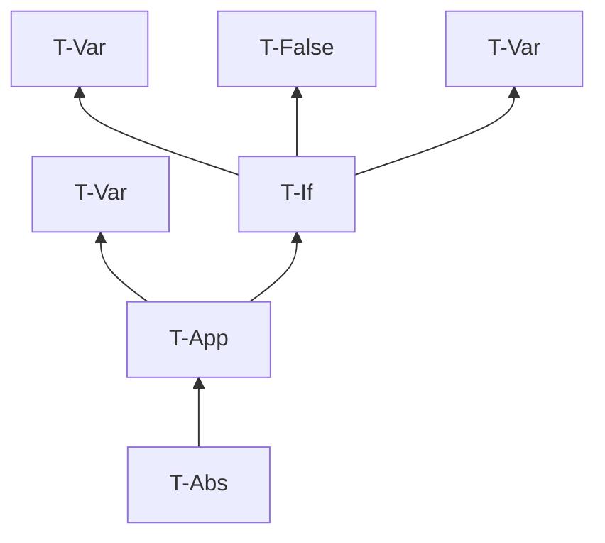

# 第 9 章 単純型付きラムダ計算

> 注意： 引用表現の部分では引用ではなく、回答の要約や解釈を書いている。

## 9.1 関数型

定義 9.1.1.

-  Bool 上の単純型の集合

## 9.2 型付け関係

- 明示的型付けを扱う
- 暗黙的型付けは第 22 章で

### 演習 9.2.1. $[\star]$

- 縮退ってなんだっけ
- ここでは、well typed な項が1つもないことを説明する

あらゆる項は評価を繰り返すことにより、行き詰まり状態になるか、値になる。
純粋型付きラムダ計算では、項が値に評価されるとき、その値はラムダ抽象値である。
ラムダ抽象値の束縛変数xはメタ変数の型Tを持つが、これは具体的な型ではない。
well typed であるためには具体的な型を与えればよいが、どの型付け規則も具体手な型を与えない。
よって、あらゆる項は well typed ではない。

### 演習 9.2.2. $[\star \nrightarrow]$

全部書くと大変なので型付け規則だけ。

#### (1)

#### (2)

### 演習 9.2.3. $[\star]$

サンプル: $\Gamma = {\sf f : Bool \rightarrow Bool \rightarrow Bool, x : Bool, y : Bool}$

集合を表す記述: $\Gamma = {\sf \forall T_1 T_2. f : T_1 \rightarrow T_2 \rightarrow Bool, x : T_1, y : T_2}$

## 9.3 型付けの性質

補題 9.3.1 [型付け関係の逆転]

- 逆転補題とも

### 演習 9.3.2. $[推奨, \star\star\star]$

存在しない。

[証明] $\Gamma \vdash {\sf x\ x : T}$ なる文脈 $\Gamma$ と型 ${\sf T}$ が存在すると仮定する。
逆転補題(3)より、 $\Gamma \vdash {\sf x\ x : T}$ ならば、  $\Gamma \vdash {\sf x : T_{11} \rightarrow T}$ と $\Gamma \vdash {\sf x : T_{11}}$ を満たす ${\sf T_{11}}$ が存在する。
このとき、文脈 $\Gamma$ の下で ${\sf x}$ が ${\sf T_{11} \rightarrow T}$ かつ ${\sf T_{11}}$ という型を持つことになり、矛盾する。
ゆえにそのような文脈 $\Gamma$ と型 ${\sf T}$ は存在しない。

> 矛盾を指摘するためには、型が有限のサイズを持つことを示す必要がある。
> 型が無限のサイズを持つことが許されるとき、${\sf T_{11} \rightarrow T} = {\sf T_{11}}$ という等式の解を構築できうる（20章）。

### 定理 9.3.3. $[推奨, \star\star\star]$

方針: 項がある形を持つとき、項は型を持つ→型を持つならそれは関数の型またはBool型のどちらか一方を持つ、という流れにする。

[証明] 項に関する構造帰納法で示す。ある型付け文脈 $\Gamma$ と項 ${\sf t}$ について、項 ${\sf t}$ が

- 変数 x と表されるとき、 仮定より、 $\Gamma$ の定義域に含まれる自由変数であるため、
  ある型 ${\sf T}$ が存在して、 $\Gamma \vdash {\sf x:T}$ となる。
  このとき型付け規則は T-App しか適用できないため、型 ${\sf T}$ は関数の型にならず、とりうる型はBoolのみである。ゆえに唯一の型を持つ。
- ラムダ抽象 $\lambda {\sf x:T.t_1}$ の形で表され、
  - 部分項 ${\sf t_1}$ が唯一の型 ${\sf T_1}$ を持つとする。
    このとき型付け規則は T-Abs のみが適用でき、 $\Gamma \vdash \lambda {\sf x:T.t_1 : T \rarr T_1}$ となり、これは関数の型である。
  - 部分項 ${\sf t_1}$ が型を持たない場合は、どの型付け規則も適用できないため項 ${\sf t}$ も型を持たない。
- 関数適用 ${\sf t_1 \ t_2}$ の形で表され、
  - 部分項 ${\sf t_1}$ が ${\sf T_{11} \rarr T_{12}}$ の形をした唯一の型を持ち、かつ、部分項 ${\sf t_2}$ が唯一の型 ${\sf T_{12}}$ を持つとする。
    このとき型付け規則は T-App のみが適用でき、 $\Gamma \vdash {\sf t_1 \ t_2 : T_{12}}$ となり、帰納法の仮定より部分項 ${\sf t_2}$ の唯一の型 ${\sf T_{12}}$ は関数の型またはBool型のどちらか一方を持つので、項 ${\sf t}$ も所望の性質が成り立つ。
  - それ以外の場合は、どの型付け規則も適用できないため項 ${\sf t}$ は型を持たない。

> - 項が2つの型を持つことを仮定し、型の導出に関する帰納法により、2つの型が等しくなることを示す。
>   - 唯一性の証明をするときの常套手段っぽい
>     - $\forall x. P(x,s)かつP(x,t)$ を仮定 → $s=t$ を示す
> - ここでは、片方の型を型付け規則による導出、もう片方を逆転補題に使い、部分項が仮定より等しくなることを使って2つの型が等しいことを示す
> - 各型付け規則で場合分け
>   - T-Trueとかを忘れないように（忘れてた）

