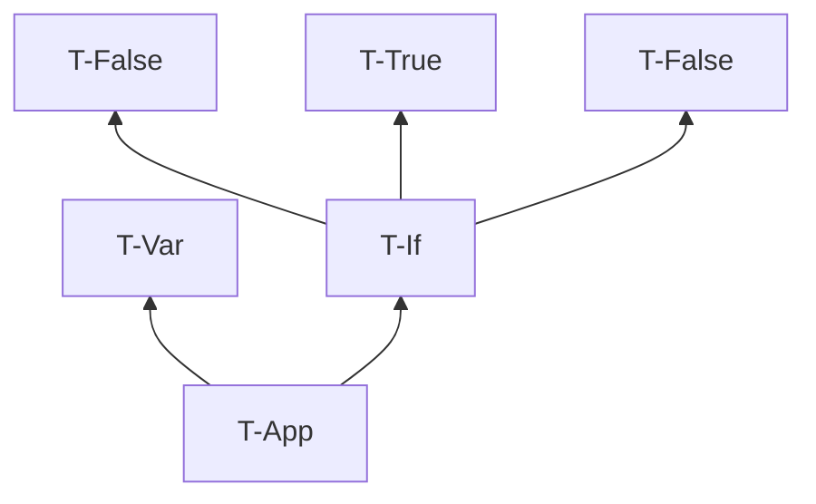
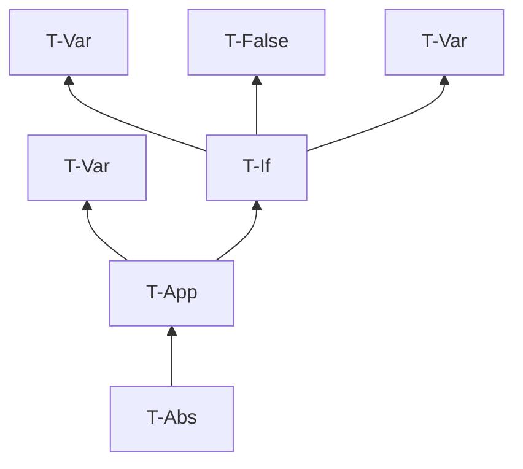

# 第 9 章 単純型付きラムダ計算

## 9.1 関数型

定義 9.1.1.

-  Bool 上の単純型の集合

## 9.2 型付け関係

- 明示的型付けを扱う
- 暗黙的型付けは第 22 章で

### 演習 9.2.1. $[\star]$

- 縮退ってなんだっけ
- ここでは、well typed な項が1つもないことを説明する

あらゆる項は評価を繰り返すことにより、行き詰まり状態になるか、値になる。
純粋型付きラムダ計算では、項が値に評価されるとき、その値はラムダ抽象値である。
ラムダ抽象値の束縛変数xはメタ変数の型Tを持つが、これは具体的な型ではない。
well typed であるためには具体的な型を与えればよいが、どの型付け規則も具体手な型を与えない。
よって、あらゆる項は well typed ではない。

### 演習 9.2.2. $[\star \nrightarrow]$

全部書くと大変なので型付け規則だけ。

#### (1)

#### (2)

### 演習 9.2.3. $[\star]$

サンプル: $\Gamma = {\sf f : Bool \rightarrow Bool \rightarrow Bool, x : Bool, y : Bool}$

集合を表す記述: $\Gamma = {\sf \forall T_1 T_2. f : T_1 \rightarrow T_2 \rightarrow Bool, x : T_1, y : T_2}$

## 9.3 型付けの性質

補題 9.3.1 [型付け関係の逆転]

- 逆転補題とも

### 演習 9.3.2. $[推奨, \star\star\star]$

存在しない。

#### [証明] 

$\Gamma \vdash {\sf x\ x : T}$ なる文脈 $\Gamma$ と型 ${\sf T}$ が存在すると仮定する。
逆転補題(3)より、 $\Gamma \vdash {\sf x\ x : T}$ ならば、  $\Gamma \vdash {\sf x : T_{11} \rightarrow T}$ と $\Gamma \vdash {\sf x : T_{11}}$ を満たす ${\sf T_{11}}$ が存在する。
このとき、文脈 $\Gamma$ の下で ${\sf x}$ が ${\sf T_{11} \rightarrow T}$ かつ ${\sf T_{11}}$ という型を持つことになり、矛盾する。
ゆえにそのような文脈 $\Gamma$ と型 ${\sf T}$ は存在しない。

